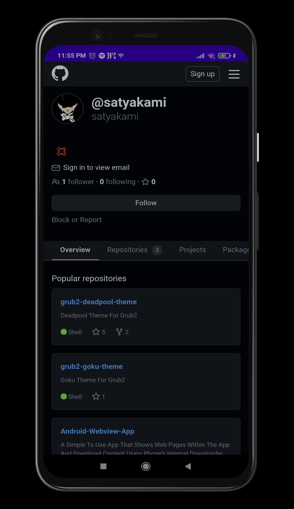

Disclaimer: This is a sample code provided for educational purposes. Make sure to test thoroughly and adapt it to your specific requirements before using it in production environments.

# Android-Webview-App
This Android application demonstrates how to use a WebView to display web content, handle file downloads, and manage network connectivity.

[](http://developer.android.com/index.html)
[](https://android-arsenal.com/api?level=30)

## Features
* **WebView Integration:** Utilizes Android's WebView to display web content within the application.
* **JavaScript Support:** Enables JavaScript execution within the WebView for interactive web experiences.
* **File Download Handling:** Implements a DownloadListener to handle file downloads initiated within the WebView.
* **Network Connectivity Management:** Monitors network connectivity changes and adjusts WebView content accordingly.
* **Offline Mode Handling:** Displays an offline HTML page when there is no network connection available.


## Compatibility
This code is compatible with devices running Android API level 30 (Android 11) and above.

## Contributions
Contributions are welcome! If you find any issues or have suggestions for improvements, feel free to open an issue or create a pull request.

### Screenshot


### Demo

Download here : [Demo Apk](app/release/app-release.apk)

# Getting Started
To integrate this code into your Android project, follow these steps:

1. Create a new Android project in Android Studio.
2. Replace the contents of `MainActivity.java` with the provided code.
3. Customize layout files and assets as per your requirements.
4. Ensure to handle necessary permissions for internet access and file storage in the `AndroidManifest.xml` file.

You can also [download the repository](https://github.com/bishwassagar/Android-Webview-App/archive/refs/heads/master.zip) or clone it and import it directly into Android Studio.

## Changing the Website URL 
To use your desired website URL:

1. Open the `app/src/main/java/com/webview/myapplication/MainActivity.java` file.
2. Replace `https://github.com/BishwasSagar` with your desired URL.
```java
mWebView.loadUrl("https://github.com/BishwasSagar");
```
Make sure to update both occurrences, found on lines **52** and **62**.


